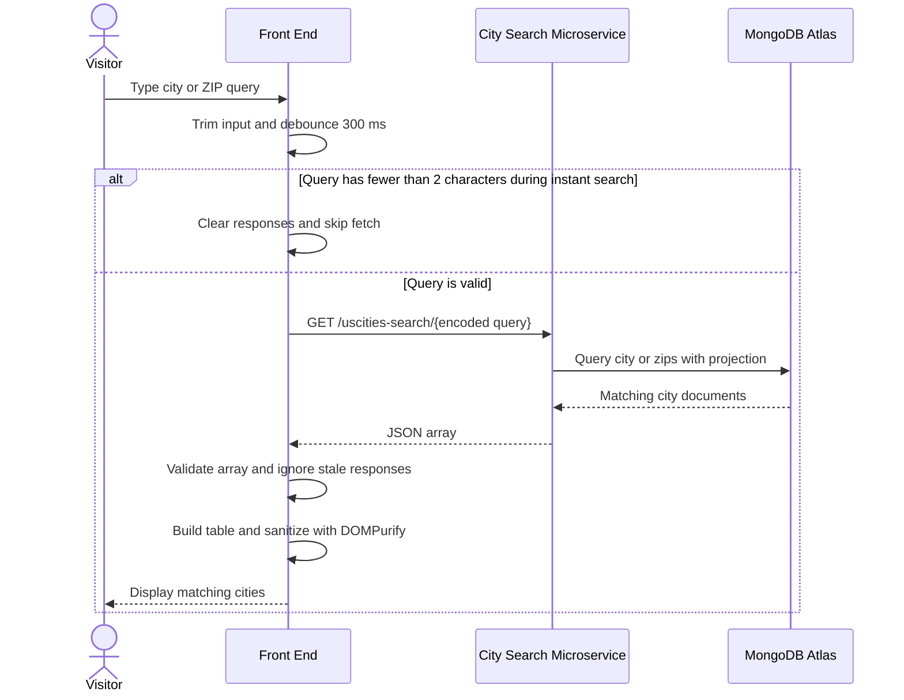

# Lab 4 Task 2 Report - City Search Front End

## Introduction

This lab provides hands-on experience building and deploying a City Search application with RESTful microservices backed by MongoDB Atlas and a front end that integrates with the microservice APIs.

The lab is organized into three lecture-based phases:

- Task 0 - Preparation: microservice skeleton, MongoDB Atlas connection, Docker deployment setup, and database import.
- Task 1 - Database Microservices: RESTful City Search API supporting ZIP code and city-name lookups, deployed to Azure App Services with Docker.
- Task 2 - Front-End Development: static front end that integrates with the deployed Task 1 API, handles JSON responses, and supports live instant search requests.

## Submission URLs

- GitHub repository: `git@github.com:Braden-Preston-dev/uscities-mircroservices.git`
- GitHub Pages live app URL: `https://braden-preston-dev.github.io/uscities-mircroservices/`
- Task 1 Azure API URL: `https://braden-preston-dev-uscities-microservices-haaxd4g4g0bwcbb7.canadacentral-01.azurewebsites.net`

Note: the GitHub Pages URL is based on the repository remote name and should be verified in the GitHub Pages settings after deployment.

## SSDLC Analysis

### Problem Statement

Users need a simple browser-based interface for searching United States city records by ZIP code or city name. The front end must call the City Search Microservice without refreshing the page and present returned data in a readable format.

### Primary Use Case

Use case: Search for a city record

Actor: Visitor

Preconditions:

- The browser can load the static front end.
- The Task 1 City Search Microservice is running.
- MongoDB Atlas contains the `uscities` data collection.

Main flow:

1. The visitor opens the City Search page.
2. The visitor enters a city name, partial city name, or ZIP code.
3. The page sends a fetch request to `/uscities-search/{query}`.
4. The microservice queries MongoDB using the existing projection fields.
5. The front end receives a JSON array.
6. The front end displays matching city records in the page without a refresh.

Alternative flows:

- If the query is empty, the front end does not send a request.
- If no records match, the front end displays `No cities found`.
- If the request fails or the response is malformed, the front end displays `Error: could not load results.`
- If the user types quickly, the front end waits about 300 ms after the last keystroke before searching.

### User Stories

- As a visitor, I want to search by city name so that I can find matching city records.
- As a visitor, I want to search by ZIP code so that I can find the city associated with a ZIP code.
- As a visitor, I want partial matches so that I can find cities even when I only know part of the name or ZIP.
- As a visitor, I want results to appear without a page refresh so that searching feels fast.
- As a visitor, I want only current results to appear while I type so that older responses do not overwrite newer searches.
- As a developer, I want the front end to sanitize displayed API data so that unsafe content is not injected into the page.

### Acceptance Criteria

- AC1: Given a city name is entered, when the Search button is clicked, matching cities are requested from the microservice and displayed.
- AC2: Given a ZIP code is entered, when the Search button is clicked, matching ZIP results are requested and displayed.
- AC3: Given an empty or whitespace-only query, when search is attempted, no fetch request is sent.
- AC4: Given valid JSON data is returned, when the response is an array, the data is displayed on the page.
- AC5: Given at least 2 characters are typed, when a key is pressed, cities whose ZIP or name contains the typed text are shown as partial matches.
- AC6: Given the visitor keeps typing, when older responses return later, stale results are ignored and only the current input is displayed.
- AC7: Given rapid keystrokes, when the user pauses typing, requests are debounced about 300 ms after the last keystroke.
- AC8: Given an empty result array, the page displays `No cities found`.
- AC9: Given a failed request or malformed response, the page displays `Error: could not load results.`
- AC10: Given API data is displayed in an HTML table, the generated HTML is sanitized with DOMPurify before insertion into the page.

## SSDLC Design

### Architecture

The system uses a static browser front end and an Express/MongoDB REST microservice.

- `index.html`: page structure, search input, Search button, response container, DOMPurify script, and client script.
- `client.js`: fetch integration, event listeners, debounce logic, stale response protection, JSON validation, table rendering, and DOMPurify sanitization.
- `server.js`: Express app, MongoDB Atlas connection, ZIP route, city route, and static file serving for local testing.
- MongoDB Atlas: `uscities-microservices` database with the `uscities` collection.

### API Design

Endpoint used by the front end:

```text
GET /uscities-search/{query}
```

Examples:

```text
/uscities-search/Cincinnati
/uscities-search/cincy
/uscities-search/45220
```

The request query is encoded with `encodeURIComponent(query)`.

The expected response is a JSON array. Each object contains projected fields only, excluding `_id`.

### Sequence Diagram



## Implementation

### Repository Setup and Software Artifacts

The Task 2 front-end artifacts are:

- `index.html`
- `client.js`
- `server.js`
- `package.json`
- `package-lock.json`
- `Dockerfile`
- `.dockerignore`
- `.gitignore`

The page contains:

- A search input with `id="search-input"`.
- A Search button with `id="search-button"`.
- A response container with `id="responses"`.
- DOMPurify loaded before `client.js`.

### Microservice Integration and Testing

The front end defines the deployed Azure base URL:

```javascript
const BASE_URL = 'https://braden-preston-dev-uscities-microservices-haaxd4g4g0bwcbb7.canadacentral-01.azurewebsites.net';
```

For local testing, `client.js` also selects a local API base URL when the page is opened from `localhost`, `127.0.0.1`, or `file://`. This lets the same code work locally while preserving the Azure URL for deployment.

The search function:

- Trims the input.
- Skips empty queries.
- Logs the query for debugging.
- Sends `fetch()` to `/uscities-search/{encoded query}`.
- Requires `response.ok`.
- Parses JSON.
- Verifies the response is an array.
- Calls `displaySearch(data)`.
- Shows a user-facing error message if the request fails.

### Handling JSON Data

The first implementation displayed raw JSON with:

```javascript
JSON.stringify(data, null, 2)
```

The current implementation improves readability by rendering the JSON array as an HTML table. The table is built from the keys returned by the API objects. Values are converted to strings, with nested objects or arrays serialized using `JSON.stringify`.

Because the table uses `innerHTML`, the generated markup is sanitized first:

```javascript
responsesElm.innerHTML = DOMPurify.sanitize(table, {
  ALLOWED_TAGS: ['table', 'thead', 'tbody', 'tr', 'th', 'td'],
  ALLOWED_ATTR: []
});
```

The page does not use unsanitized API data directly in `innerHTML`.

### Handling Live and Instant Requests

Instant search is implemented with an `input` event listener.

Behavior:

- Searches start only after at least 2 trimmed characters.
- Rapid keystrokes are debounced with a 300 ms timer.
- Each request receives a search id.
- When a response returns, the front end compares the response id against the latest search id.
- If an older request returns after a newer request, the older response is ignored.

This satisfies AC5, AC6, and AC7.

## DevOps

### Task 1 Microservice Deployment

The server is designed for Docker deployment and Azure App Services.

Relevant files:

- `Dockerfile`
- `package.json`
- `server.js`

The Dockerfile uses Node 24 Alpine, installs dependencies, copies the application files, and starts the server with:

```text
npm start
```

### Task 2 Front-End Deployment

The front end is deployable as static files through GitHub Pages:

- `index.html`
- `client.js`

Expected GitHub Pages URL:

```text
https://braden-preston-dev.github.io/uscities-mircroservices/
```

Expected GitHub Actions behavior:

1. Trigger on push to `main`.
2. Upload the static front-end files as a Pages artifact.
3. Deploy the artifact to GitHub Pages.

During repository inspection, the `.github` directory existed but no workflow file was found. The GitHub Pages workflow should be verified or added before final submission if it is not already configured in GitHub.

## Verification

Commands used during implementation and testing:

```bash
node --check client.js
node --check server.js
npm start
curl -i http://localhost:8080/
curl -i http://localhost:8080/uscities-search/Cincinnati
curl -i http://localhost:8080/uscities-search/45220
curl -i https://braden-preston-dev-uscities-microservices-haaxd4g4g0bwcbb7.canadacentral-01.azurewebsites.net/uscities-search/Cincinnati
```

Verified behavior:

- Local server starts successfully when network access to MongoDB Atlas is available.
- Root route serves the front-end page.
- Local city search returns a JSON array for `Cincinnati`.
- Local ZIP search returns a JSON array for `45220`.
- Empty input does not send a request.
- Empty result arrays display `No cities found`.
- Failed requests display `Error: could not load results.`
- Instant search is debounced about 300 ms.
- Stale responses are ignored.
- HTML table output is sanitized with DOMPurify.

Known issue:

- The configured Azure API URL returned `404 Cannot GET /uscities-search/Cincinnati` during testing, which indicates the Azure App Service may still be running an older deployment. The Task 1 microservice should be redeployed to Azure before final live testing of the GitHub Pages front end.

## Conclusion

Task 2 connects the browser front end to the City Search Microservice and demonstrates Ajax/fetch integration without page refreshes. The implementation supports button search, Enter-key search, live debounced search, JSON validation, sanitized HTML table rendering, empty-result handling, and request failure handling. The remaining deployment item is to verify the GitHub Pages workflow and redeploy the Azure backend so the live front end can call the latest `/uscities-search/{query}` routes.
